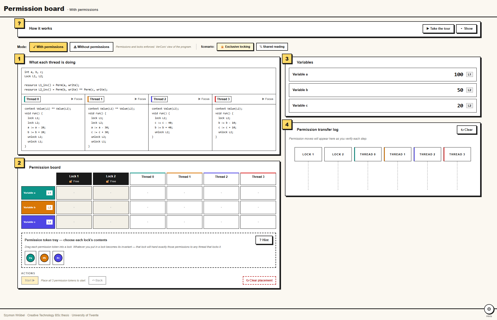
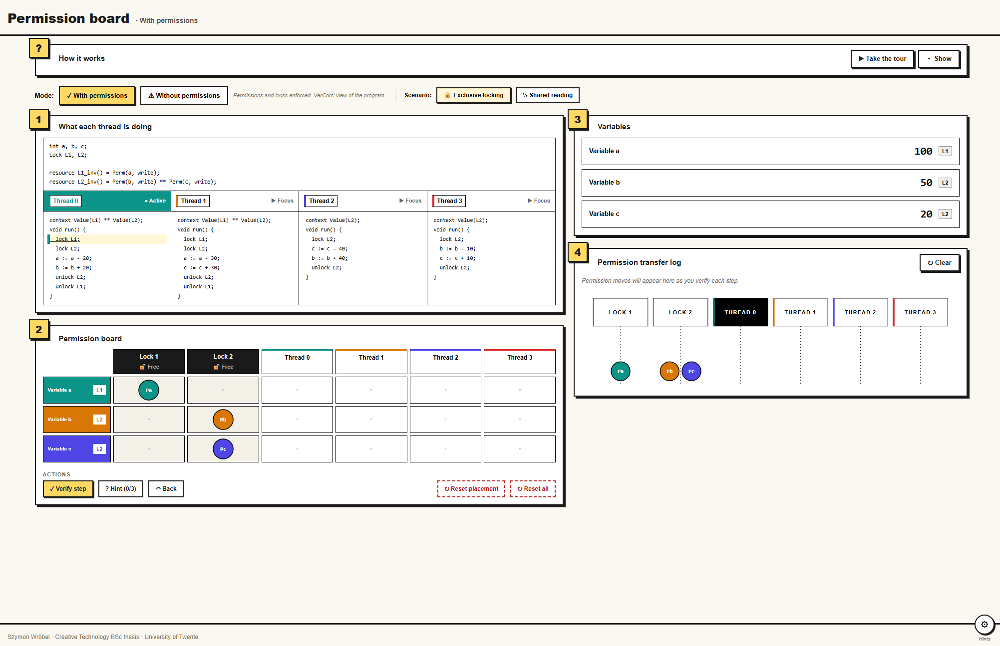
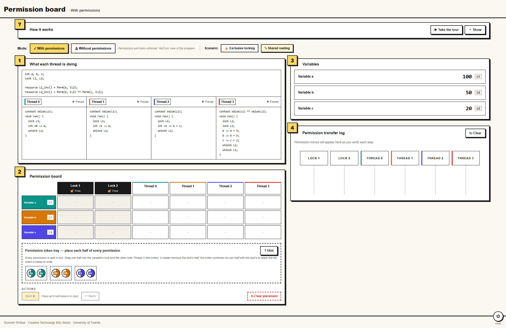
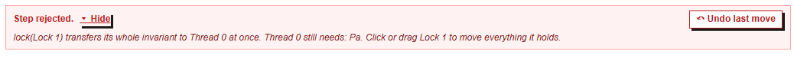
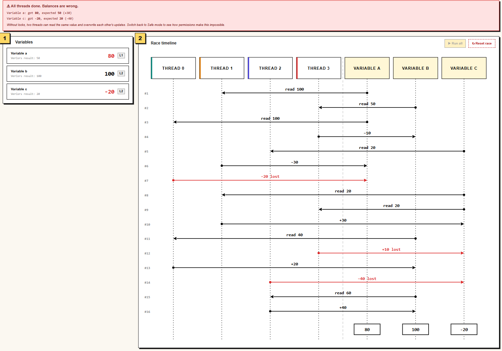
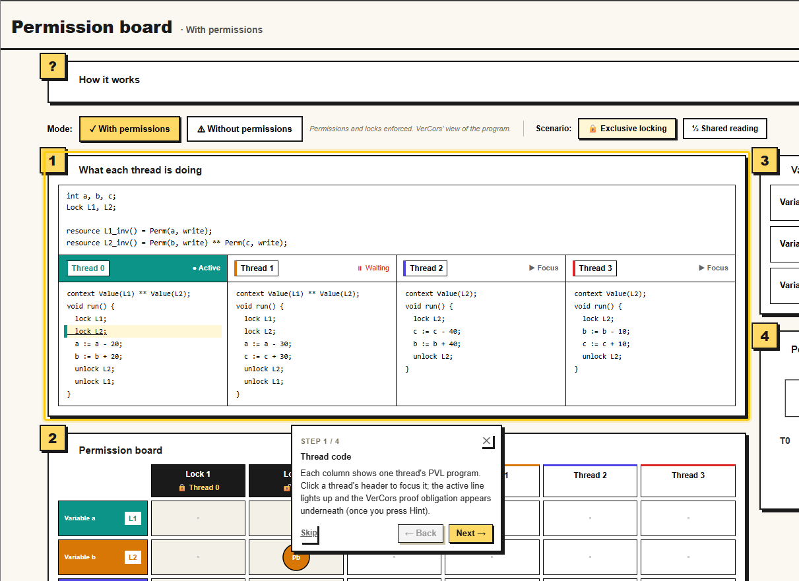

## Declaration of AI use

In accordance with University of Twente academic integrity policy,
I disclose the following use of generative AI tools.

- **Tool:** Anthropic Claude (Claude Code, Opus model), used during development.
- **What it was used for:**
  - Refactoring TypeScript/React code for the prototype.
  - Code cleanup (e.g. removing comments, simplifying logic).
- **My responsibility:** I reviewed, executed, and verified all output. The
  build, lint, and 54 unit tests pass, and I understand and can explain the
  code I am submitting.

Author: Szymon Wróbel

# VerCors Permission Board

An interactive prototype that visualises **VerCors permission transfer** in a small
concurrent program, built for a classroom setting. It has two top-level modes:

- **Safe mode** — the proof view. PVL code on the left, live variable values and a permission
  transfer log on the right, and a drag-and-drop permission board. Verify each step to watch
  permissions move between locks and threads. A sub-toggle switches between the **Standard** and
  **Fractional** scenarios.
- **Race mode** — the counterexample. The same threads with locks treated as no-ops; run all the
  threads and watch the lost-update races corrupt the final values.

## Pedagogy at a glance

The prototype teaches three ideas through one running example (three shared variables `a`, `b`, `c`
protected by two locks):

1. **Lock invariants are permissions.** When you place a token in a lock during setup, you are
   declaring "this lock owns this permission." At run time, `lock(L)` hands the entire invariant
   to the calling thread; `unlock(L)` returns it.
2. **Reads need any positive fraction; writes need the whole token.** The Fractional scenario
   splits each permission in half so a reader can hold ½ while the writer waits for the full
   share — exactly VerCors' `Perm(x, p)` semantics.
3. **Without permissions, lost updates happen.** Race mode keeps the same threads but ignores the
   locks; the timeline animates the interleaving that loses a write.

The four numbered Safe-mode sections (thread code, permission board, variables, transfer log) are
introduced by a guided onboarding tour on first visit.

## What it looks like

| | |
| --- | --- |
|  | **01 — Safe / Standard, setup phase.** The guided tour highlights the permission board; tokens still sit in the tray. |
|  | **02 — Safe / Standard, mid-run.** Thread 0 has acquired Pa from Lock 1; the FlowPanel records the transfer; the VerCors annotation under the highlighted PVL line shows the proof obligation. |
|  | **03 — Safe / Fractional, setup complete.** One half of each permission sits in the lock, the other in Thread 3 (the writer). The tray is empty. |
|  | **04 — Verify rejection.** A deliberate misplacement (Pa dropped on the wrong thread) produces a diagnostic and the new ↶ Undo last move button. |
|  | **05 — Race mode.** The sequence diagram shows two reads landing before either write, and one write is marked `lost`. Balances diverge from the expected outcome. |
|  | **06 — How it works panel.** The collapsible manual stays for reference; the ▶ Take the tour button replays the four-step intro. |

## App code

- `src/app/page.tsx` — mounts the prototype at `/`
- `src/components/permission-board/PermissionBoard.tsx` — all UI components
- `src/components/permission-board/engine.ts` — state, types, and all transitions

## License

Licensed under the **Mozilla Public License 2.0** — see [`LICENSE`](LICENSE) for the full text. The MPL is a weak file-level copyleft: you can fork, modify, embed, and redistribute the code (including in proprietary larger works), provided that any changes to MPL-covered files are themselves released under the MPL and that recipients can obtain the source. This makes the prototype safe to lift into future VerCors teaching material at the University of Twente or elsewhere.
